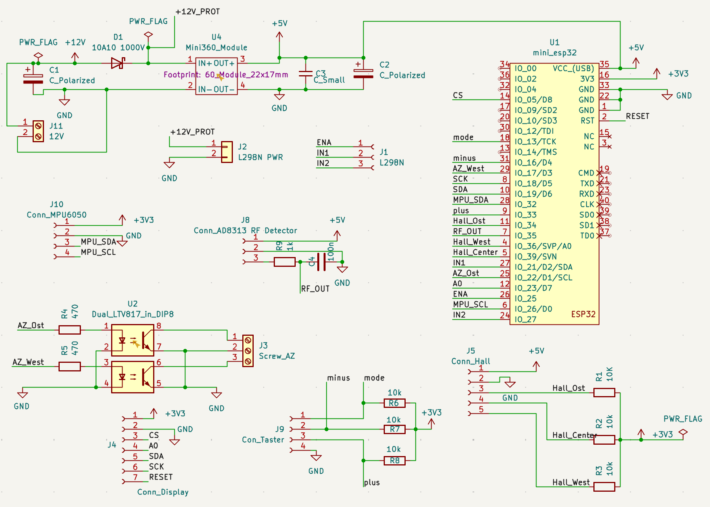
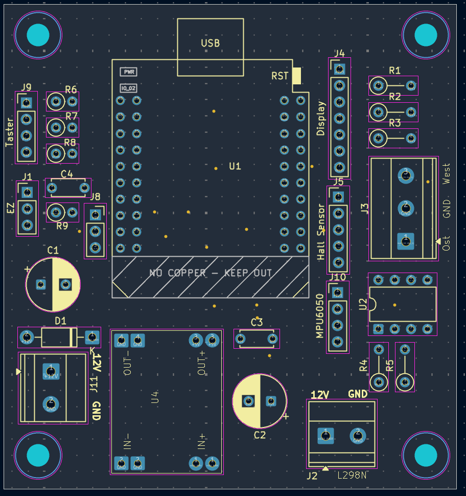

# SatAlign ESP32 V3

ESP32-based controller for manual and semi-automatic alignment of a Selfsat-style satellite antenna.

SatAlign combines an ESP32, TFT display, web interface, RF signal detection, MPU6050 elevation sensing, Hall sensor feedback and a DiSEqC-compatible azimuth motor concept to support repeatable satellite alignment for Astra 19.2°E.

---

## Current project status

### Stable tested and built version: V3.0.2

**V3.0.2** is the last fully tested and built version of SatAlign ESP32 V3.

This version was compiled, uploaded and practically tested with the existing hardware setup. It remains the recommended stable reference for anyone who wants to understand or reproduce the currently verified system behavior.

### Current development version: V3.0.3 RC1 - PCB pinout

**V3.0.3 RC1** is the current PCB pinout development version.

This version introduces the new ESP32 pin assignment for the KiCad PCB layout. The pin changes were made intentionally to improve PCB routing and create a cleaner, more practical board layout.

**Important:**  
V3.0.3 RC1 has compiled successfully, but it has **not yet been practically tested on the final PCB hardware**. It should therefore be treated as a release candidate for PCB validation, not as a final stable release.

### Pinout difference between V3.0.2 and V3.0.3 RC1

| Function | V3.0.2 tested setup | V3.0.3 RC1 PCB pinout |
|---|---:|---:|
| MPU SCL | GPIO21 | GPIO26 |
| Elevation IN1 | GPIO26 | GPIO21 |
| TFT CS | GPIO14 | GPIO5 |

The old V3.0.2 pinout remains documented as the last tested hardware setup.  
The V3.0.3 RC1 pinout is the active basis for the new PCB development and must match the KiCad PCB.

---

## What is SatAlign?

SatAlign is a DIY controller for a portable satellite antenna system.

The project supports the alignment workflow by:

- controlling elevation through a linear actuator and L298N driver
- using a DiSEqC-compatible satellite motor for azimuth movement
- reading the current elevation angle with an MPU6050 / GY-521
- detecting RF signal strength through an AD8317 / AD8318-style RF detector
- displaying local status on a 128 x 128 TFT display
- providing a simple web interface for monitoring and operation
- allowing local control through MODE, PLUS and MINUS buttons
- supporting OTA firmware updates

SatAlign does not replace a professional satellite meter. It is an experimental DIY project designed to make antenna alignment more structured, reproducible and understandable.

---

## Why a DiSEqC-compatible azimuth motor?

The use of a **DiSEqC-compatible satellite motor** is intentional.

A DiSEqC motor already provides a geared drive suitable for controlled azimuth movement. The gearbox enables a practical search speed without requiring additional custom motor mechanics. At the same time, the motor offers a stable mechanical base for the antenna structure.

For a mobile DIY setup, this keeps the azimuth design simpler, mechanically stronger and easier to reproduce.

SatAlign does not directly drive a high-power azimuth DC motor. Instead, the ESP32 controls the azimuth movement through an optocoupler-based interface to the external DiSEqC motor control concept.

---

## KiCad PCB overview

The current hardware development is based on a dedicated KiCad PCB.

The PCB replaces the earlier breadboard/test wiring and is now the active basis for further hardware development. The firmware pinout in `pins.h` must follow the PCB assignment for the V3.0.3 RC1 branch.





The PCB combines the ESP32 controller, RF detector input, MPU6050 angle sensor, Hall sensor inputs, TFT display connector, local buttons, elevation motor driver interface and optocoupler-based azimuth control interface.

Some ESP32 pins were intentionally changed compared with the earlier test wiring to make the PCB routing cleaner and mechanically more practical.

More details are available in:

```text
docs/kicad_pcb_documentation.md
```

---

## Mechanical concept and 3D printed support parts

The project also includes mechanical support parts and design concepts.

### Antenna bracket concept


The antenna bracket image shows the original concept for the antenna support with elevation movement driven by a linear actuator. This concept was later implemented in metal for the actual project hardware.

### Hall sensor rings


The Hall ring concept consists of two matching ring elements:

- the left ring contains the mount for a **4 x 2 mm magnet**
- the right ring contains the mounts for the Hall sensors

The distance between both rings should remain as even as possible around the full rotation. In the prototype assembly, small nails were used as simple spacers during mounting to keep the ring distance consistent.

### DiSEqC motor adapter


The adapter is used to mount the DiSEqC motor into the tripod structure.

The size of this adapter and the Hall sensor rings must be adapted to the actual tripod and motor dimensions. The STL files are included in the `STL/` folder.

---

## Main hardware components

Typical components used in the current design:

- ESP32 mini development board
- 128 x 128 TFT display
- MPU6050 / GY-521 sensor
- AD8317 / AD8318-style RF detector
- L298N motor driver for elevation
- 12 V linear actuator for elevation
- DiSEqC-compatible satellite motor for azimuth
- LTV817 optocouplers for azimuth control interface
- Hall sensors for azimuth reference and limit detection
- Mini360 buck converter
- MODE / PLUS / MINUS buttons
- KiCad PCB for the current hardware layout

---

## RF signal concept

SatAlign evaluates the RF detector output to recognize signal changes during the search workflow.

The RF detector output is read by the ESP32 ADC. The software uses this value to detect possible satellite candidates and compare signal strength during movement.

Important:

- lower ADC voltage can indicate stronger RF signal depending on the detector behavior
- RF thresholds are centralized in `settings.cpp`
- the receiver and RF signal path must be active during testing
- a DC blocker must be used where required to protect the RF detector input
- SatAlign evaluates signal strength, but it cannot identify the satellite name by itself

Final satellite confirmation is still done by the user:

- **PLUS** = correct satellite / Astra 19.2 confirmed
- **MINUS** = wrong satellite / continue search or restart relevant search step

---

## Current firmware behavior

Implemented in the tested baseline and retained for PCB development:

- automatic search workflow
- RF candidate detection during normal search
- RF candidate detection during center alignment
- stricter candidate handling for very good center RF values
- PLUS / MINUS candidate workflow
- final green “Astra 19.2 found” confirmation screen
- MODE long press returns to main menu
- MPU fatal boot stop screen if the MPU6050 / GY-521 is missing
- Info menu with SSID, IP address and ESP reset
- OTA support through local `secrets.h`

---

## Firmware configuration

Private credentials are not stored in the repository.

Use:

```text
secrets.example.h
```

as a template and create your own local:

```text
secrets.h
```

The local `secrets.h` must not be committed to GitHub.

Typical local values:

- WiFi SSID
- WiFi password
- OTA password
- hostname

---

## PCB and manufacturing status

Before ordering or assembling the PCB, always run:

- KiCad Electrical Rules Checker (ERC)
- KiCad Design Rules Checker (DRC)
- zone refill before DRC
- Gerber viewer inspection
- drill file inspection
- diode polarity check
- electrolytic capacitor polarity check
- connector orientation check
- comparison between `pins.h`, schematic and PCB

The V3.0.3 RC1 PCB pinout version should only become a final release after the assembled PCB has been practically validated.

---

## Version guidance

Use the versions as follows:

| Version / branch | Status | Recommended use |
|---|---|---|
| V3.0.2 | tested and built stable version | stable reference |
| pcb-pinout-v3.0.3 | current PCB development branch | PCB validation work |
| V3.0.3 RC1 | compiled release candidate | not yet practically PCB-tested |

---

## License and disclaimer

This project is provided as an open DIY project.

You may study, modify and improve the project. Use it at your own risk.

Satellite systems, motor drivers, 12 V wiring, RF components and outdoor mechanical structures can cause damage if wired or used incorrectly. Always verify wiring, voltage levels, polarity, current ratings and mechanical safety before powering the system.
