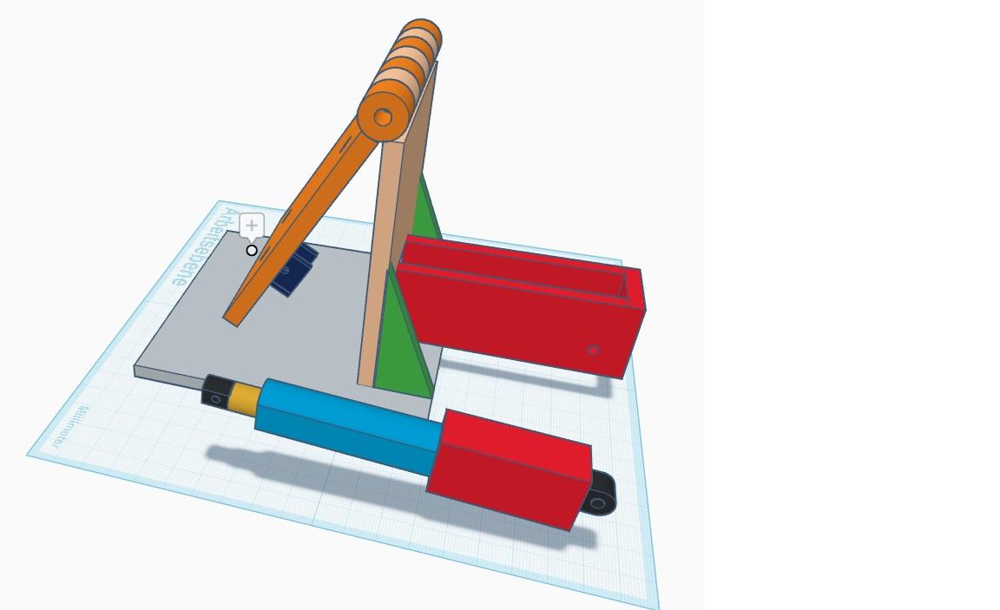
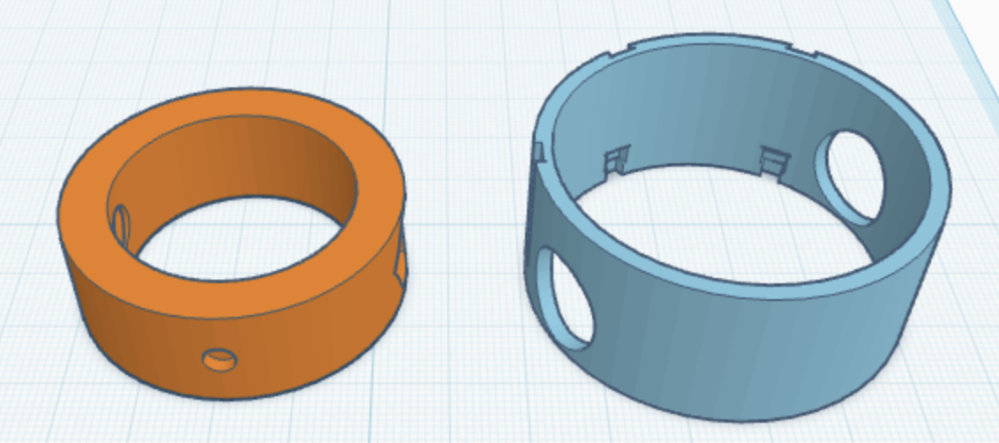
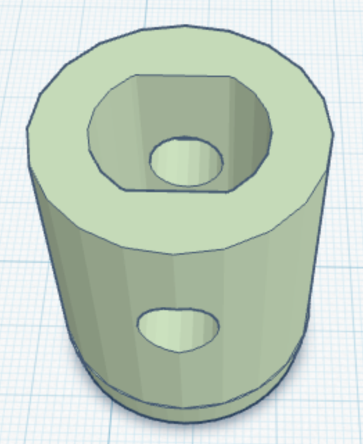

# SatAlign ESP32 V3

**ESP32-based manual and semi-automatic satellite antenna alignment for mobile Selfsat-style setups.**

SatAlign ESP32 V3 is a DIY controller for aligning a flat satellite antenna while travelling with a camper, van or mobile setup. It combines **DiSEqC-based azimuth movement**, **motorized elevation control**, **MPU6050 angle feedback**, **RF signal detection**, a **local TFT display**, a **mobile web interface** and **OTA updates** in one compact ESP32 project.

The goal is not to replace a professional automatic satellite system. The goal is to build an understandable, modifiable and field-testable open DIY system that helps with real-world satellite alignment.

<p align="center">
  
</p>

<p align="center"><em>Early antenna holder concept with elevation linear actuator. The mechanical idea shown here was later implemented in metal for the real project.</em></p>

---

## Why this project exists

Aligning a satellite antenna by hand while travelling can be frustrating: the elevation angle must be roughly correct, the antenna must be moved carefully in azimuth, the receiver must already be active, and small mechanical changes can decide whether a usable signal is found or not.

SatAlign was created as a practical solution for this problem. It provides a structured alignment workflow, visual feedback and RF-based candidate detection so the user can find and confirm the correct satellite more reliably.

---

## Current project status

**Current stable baseline:** `v3.0.0`

This version has been tested as a working baseline and is used as the starting point for further development.

Implemented in the current baseline:

- DiSEqC-compatible azimuth movement workflow
- elevation actuator control
- MPU6050 / GY-521 elevation angle measurement
- RF signal detection with AD8317 / AD8318-style detector logic
- satellite candidate detection during the search workflow
- RF candidate detection already during center alignment
- PLUS / MINUS candidate confirmation workflow
- final “Astra 19.2 found” confirmation screen
- TFT-based local operation
- mobile web interface
- Info menu with SSID, IP address and ESP reset function
- OTA update support
- GitHub-safe configuration using `secrets.example.h`

---

## Key features

### Semi-automatic search workflow

SatAlign guides the antenna through a structured alignment sequence. During the search, RF signal changes are evaluated and possible satellite positions are presented as candidates.

The system does **not** blindly decide that a signal is Astra 19.2. Instead, the user confirms the candidate:

- **PLUS** = correct satellite confirmed
- **MINUS** = wrong satellite, continue or restart the search logic depending on the search state

### RF candidate detection during center alignment

If the antenna is already roughly pointing toward the correct satellite, a usable signal may appear during the center alignment movement. The current version can detect this and stop immediately instead of driving past the signal.

### DiSEqC-based azimuth movement

Azimuth movement is handled through a **DiSEqC-compatible satellite motor setup**. SatAlign does not directly drive a separate DC motor for azimuth movement.

This choice is intentional: a DiSEqC-compatible satellite motor already provides a suitable geared drive for controlled azimuth movement. The gearbox enables a practical search speed without requiring additional custom motor mechanics, while the motor itself offers a robust and stable mechanical base for the antenna structure. For a mobile DIY setup, this keeps the azimuth design simpler, mechanically stronger and easier to reproduce.

### Mechanical concept and 3D printed support parts

The mechanical setup combines a metal antenna holder, an elevation linear actuator and several printable support parts. The 3D models are intended as project-specific construction aids and may need to be adapted to the dimensions of the individual tripod, motor and antenna setup. The STL files are stored in the `STL/` folder.

#### Antenna holder and elevation actuator

The antenna holder drawing shows the original idea for the elevation mechanism: a Selfsat-style flat antenna is mounted on a pivoting holder and moved by a linear actuator. In the real project, this concept was implemented in metal to achieve a more stable mechanical structure for outdoor use.

<p align="center">
  
</p>

#### Hall sensor and magnet rings

The Hall ring system consists of two matching parts:

- the left ring contains the mount for a **4 x 2 mm magnet**
- the right ring holds the Hall sensors used for center / east / west reference detection

For reliable switching behavior, the distance between both rings should remain as even as possible around the full rotation path. In the prototype, this spacing was set mechanically during assembly with small nails used as simple distance guides. Depending on the exact tripod and motor geometry, both ring dimensions may need to be adjusted before printing.

<p align="center">
  
</p>

#### DiSEqC motor tripod adapter

The adapter part is used to mount the DiSEqC-compatible satellite motor into the tripod structure. Its dimensions are not universal: both the adapter and the Hall rings must be adapted to the specific tripod, motor diameter and mechanical tolerances used in the build.

<p align="center">
  
</p>

### Motorized elevation

Elevation is moved separately by an elevation actuator and monitored with an MPU6050 / GY-521 sensor.

### Local and web control

The project can be operated locally through the TFT display and buttons, or through the mobile web interface.

### OTA updates

Once Wi-Fi and OTA credentials are configured locally, the ESP32 can be updated over the network.

---

## Hardware overview

Typical hardware used in this project:

- ESP32 development board
- Selfsat-style flat satellite antenna
- DiSEqC-compatible satellite motor for azimuth movement
- elevation actuator
- motor driver for the elevation actuator
- MPU6050 / GY-521 sensor for elevation angle measurement
- A3144 Hall sensors for center / east / west reference signals
- AD8317 or AD8318 RF detector module
- SAT splitter / tap depending on the RF setup
- DC blocker between satellite signal path and RF detector
- F-plug / SMA adapter and suitable coax cable
- ST7735 1.44 inch TFT display
- local push buttons
- satellite receiver
- optional 3D printed adapter parts and Hall sensor / magnet rings from the `STL/` folder

> **Important:** The DC blocker must be installed before the RF detector input. The LNB supply voltage can be 13 V / 18 V. Without a DC blocker, the RF detector can be damaged.

---

## RF signal logic

The RF detector is evaluated inversely:

- lower ADC / voltage value = stronger RF signal
- higher ADC / voltage value = weaker or no usable RF signal

SatAlign uses practical threshold values from real-world testing. These values are not universal. They depend on the receiver, LNB, splitter, attenuation, cable length, RF detector module and wiring.

The current version uses RF values for:

- signal detection
- signal comparison
- candidate detection
- candidate confirmation workflow

It does **not** include a separate automatic signal optimization function. Final validation and possible mechanical fine adjustment remain the user's responsibility.

---

## Basic operation

1. Switch on the satellite receiver.
2. Roughly point the antenna toward the south.
3. Power on the SatAlign controller.
4. Start the search workflow.
5. SatAlign performs center alignment and evaluates RF signal changes.
6. If a candidate is found, check the TV picture.
7. Press **PLUS** if the candidate is Astra 19.2.
8. Press **MINUS** if it is the wrong satellite.
9. If Astra 19.2 is confirmed, SatAlign shows a final confirmation screen.
10. The device can then be powered off or returned to the menu with a long MODE press.

---

## Button concept

Typical local button behavior:

- **PLUS**: select, increase, move or confirm depending on the current screen
- **MINUS**: select, decrease, move or reject depending on the current screen
- **MODE short**: confirm / start selected function
- **MODE long**: cancel / return to menu depending on the current state

---

## Web interface

The mobile web interface provides access to:

- main menu
- align / center workflow
- search workflow
- manual control
- status and diagnosis
- RF signal display
- SSID and IP information
- ESP reset function
- troubleshooting support

The web UI is intended as a practical field interface for testing, diagnosis and operation.

---

## Configuration and secrets

Private access data is not stored in the repository.

Before compiling, copy:

```text
secrets.example.h
```

to:

```text
secrets.h
```

Then enter your local Wi-Fi and OTA credentials in `secrets.h`.

Example structure:

```cpp
#pragma once

struct WifiCredential {
  const char* ssid;
  const char* password;
};

static const WifiCredential WIFI_NETWORKS[] = {
  { "YOUR_WIFI_NAME", "YOUR_WIFI_PASSWORD" },
};

static const int WIFI_NETWORK_COUNT =
  sizeof(WIFI_NETWORKS) / sizeof(WIFI_NETWORKS[0]);

static const char* WIFI_HOSTNAME = "sat-tracker";
static const char* OTA_PASSWORD = "YOUR_OTA_PASSWORD";
```

`secrets.h` must remain local and must not be committed to GitHub.

---

## Recommended repository structure

```text
SatAlign_ESP32_V3/
├── SatAlign_ESP32_V3.ino
├── live_runtime.cpp / .h
├── display_ui.cpp / .h
├── web_server.cpp / .h
├── rf_detector.cpp / .h
├── azimuth_control.cpp / .h
├── elevation_control.cpp / .h
├── sensor_mpu6050.cpp / .h
├── config.h
├── pins.h
├── settings.cpp / .h
├── secrets.example.h
├── docs/
└── tools/
```

Test and utility sketches should be placed in `tools/`.

Additional documentation can be placed in `docs/`.

---

## Safety notes

This is a DIY project. Use it at your own risk.

Before operating the system, check carefully:

- motor direction
- DiSEqC motor behavior
- elevation actuator limits
- Hall sensor states
- RF detector wiring
- DC blocker placement
- LNB voltage path
- mechanical end stops
- power supply stability
- all cables and connectors

Never connect the RF detector directly to a path that may carry LNB supply voltage without proper protection.

---

## Roadmap / ideas for future improvements

Possible future improvements:

- improved diagnostic web UI
- clearer RF threshold tuning page
- additional AZ position diagnostics
- more detailed troubleshooting messages
- complete wiring documentation
- structured installation and field-test guide
- cleanup of older helper modules after further stable testing

---

## License and reuse

This is a personal open DIY project. You are welcome to study, modify, adapt and improve the code for your own experiments and setups.

No warranty is provided. The author is not responsible for damage caused by wiring errors, incorrect RF connections, mechanical movement, motor control issues or unsafe operation.

---

## Credits

Project idea, practical testing, hardware decisions and requirements: **Hans-Peter Voß**

Programming support, comments and documentation assistance: **ChatGPT GPT-5.5**
